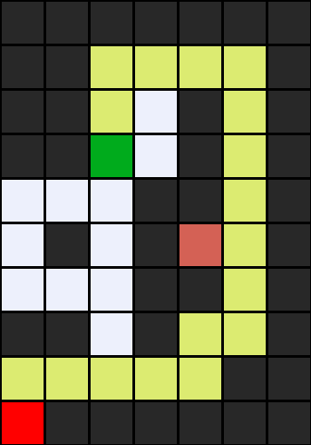
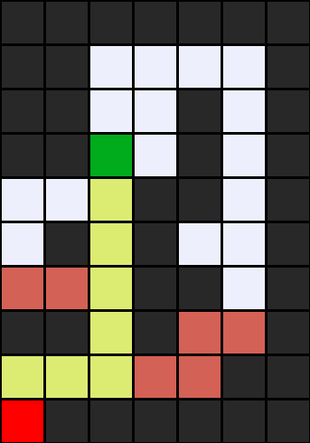
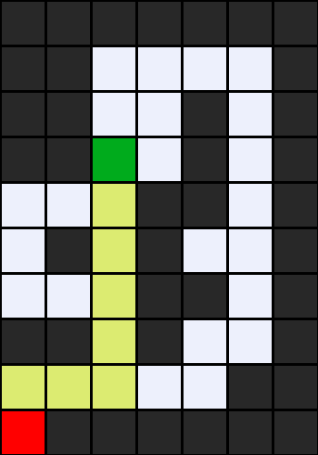

# Maze Greedy Search

Nama: Irfan Chairurrachman

NIM: 18106050016

**Penjelasan kode:**

Asal kode ini dari [CS50 AI week 0](https://cs50.harvard.edu/ai/2020/weeks/0/) untuk mencari solusi dari suatu labirin/maze dengan algoritma DFS (Stack) dan BFS (Queue).

Saya menambahkan class GreedyFrontier turunan dari StackFrontier untuk menerapkan Greedy-Best Search dalam pencarian solusi. method yang saya ubah dari class master/parent adalah:

- `def remove(self,goal)` mengambil parameter lokasi goal stete untuk menentukan node selanjutnya berdasarkan nilai terdekat dari goal state.
karena mengambil parameter goal state, maka pada `class Maze()` atribut `solve(self)`, diharapkan untuk memastikan bahwa node yang diinisiasi harus `node = frontier.remove(self.goal)`

- `def cek(self)` berfungsi untuk mengecek seberapa banyak pilihan state saat itu. Cek berdasarkan atribut parent.

Perbedaan State yang dilalui untuk maze4.txt=

kuning: solusi

merah: state yang dilalui

- Depth-First Search (Stack)

- Breadth-First Search (Queue)

- Greedy-Best Search

